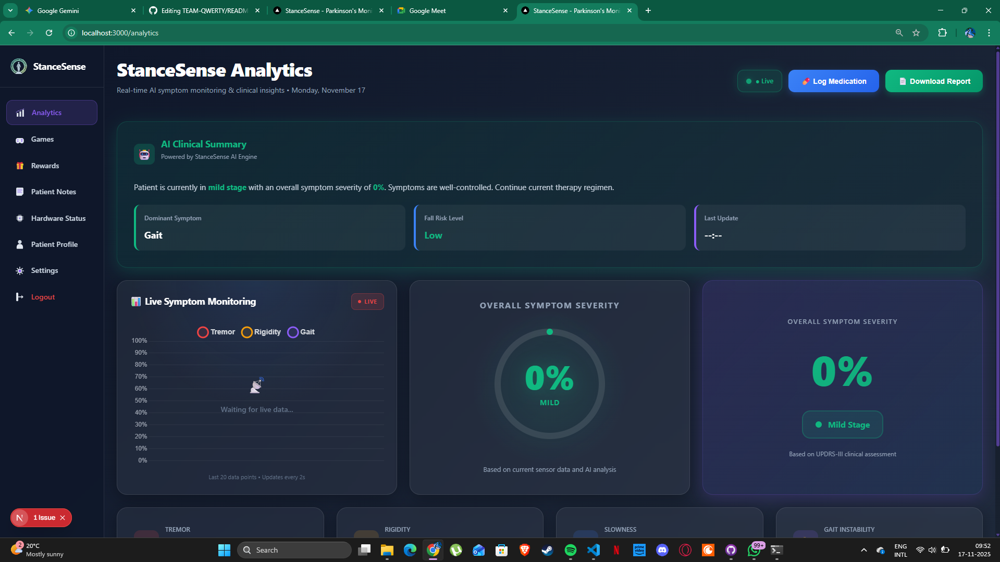
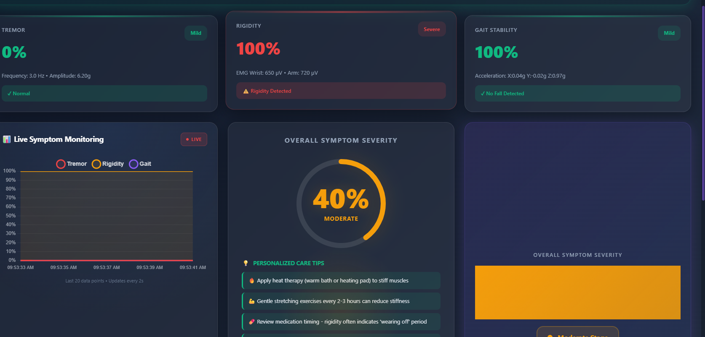
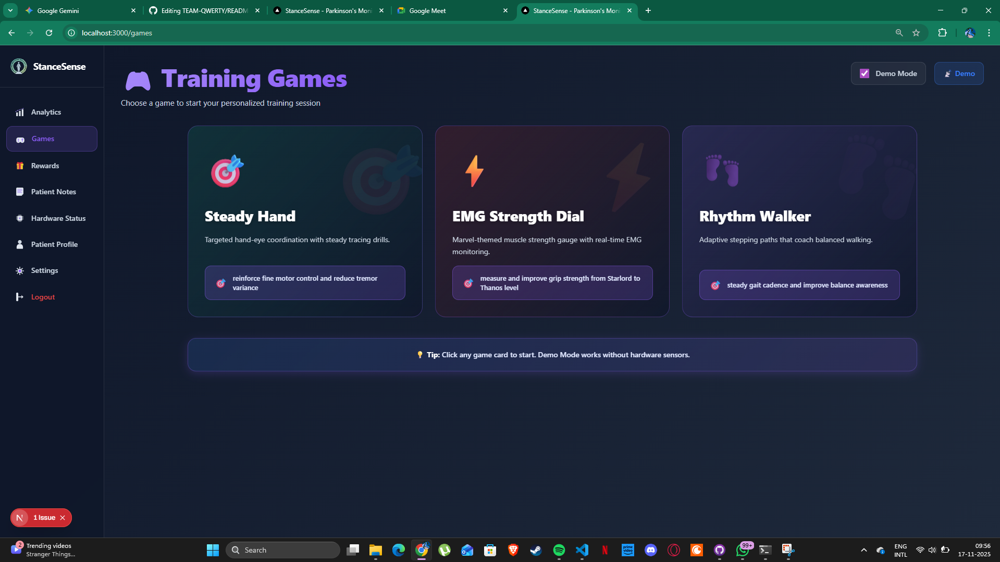
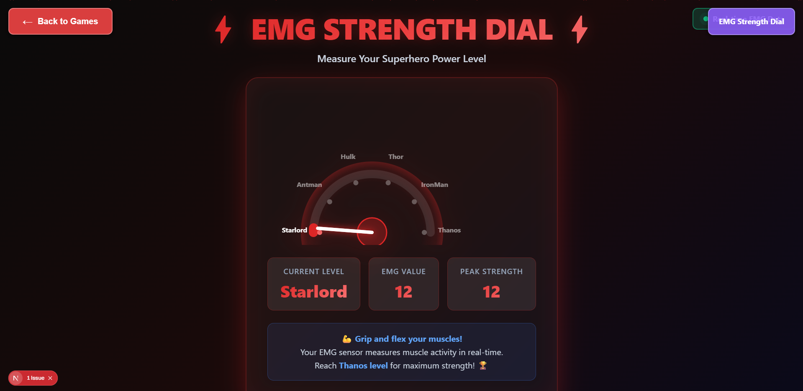
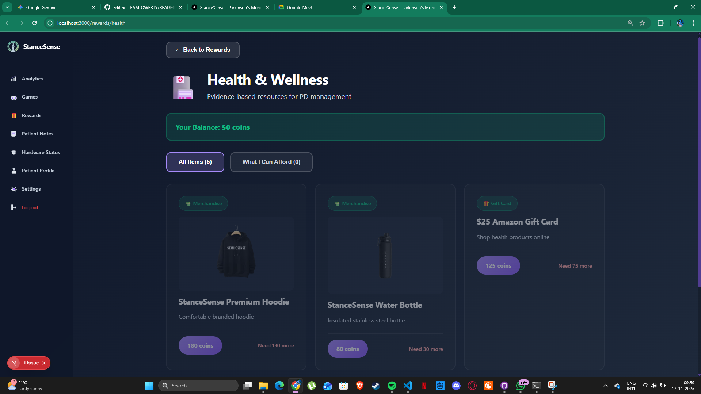
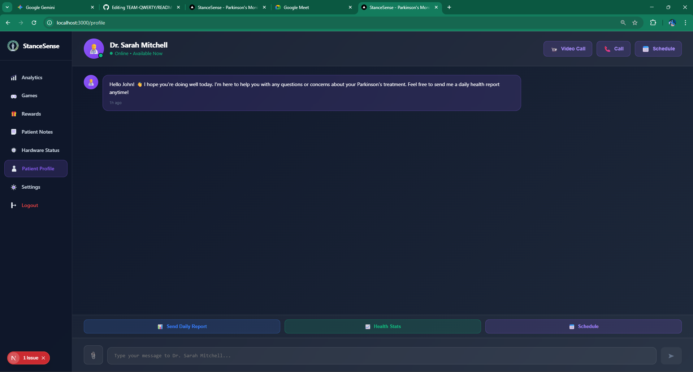
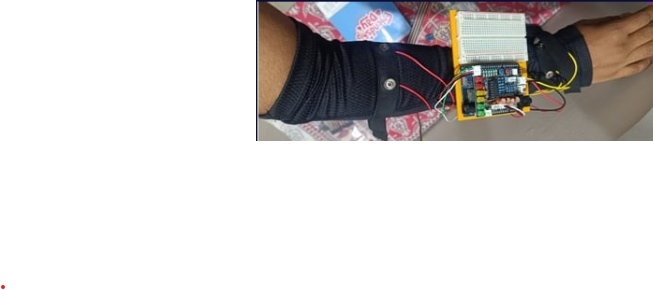
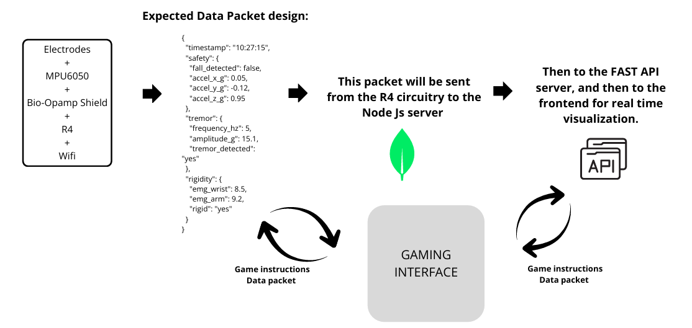
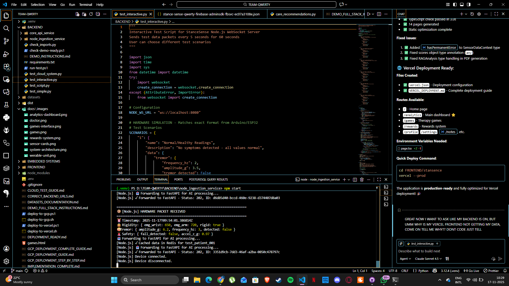
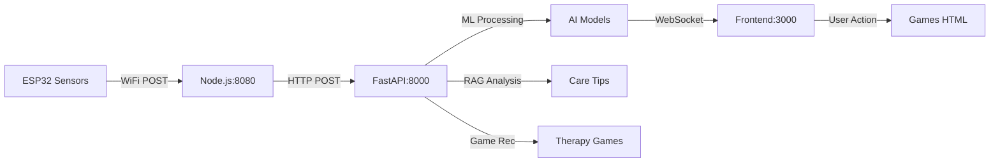

# 🏥 StanceSense - AI-Powered Parkinson's Disease Monitoring System

**Real-time Symptom Monitoring & Clinical Insights Platform**

> A comprehensive IoT-enabled web platform with AI-powered analysis for Parkinson's disease patients, caregivers, and healthcare providers featuring real-time tremor detection, rigidity monitoring, gait analysis, and personalized therapy recommendations.

[](https://nextjs.org/)
[](https://fastapi.tiangolo.com/)
[](https://www.typescriptlang.org/)
[](https://www.python.org/)
[](https://developer.mozilla.org/en-US/docs/Web/API/WebSockets_API)

---
## 👥 Team QWERTY

### Core Team
-   **[ROHANBAIJU](https://github.com/ROHANBAIJU)**: Lead Developer
    * AI/ML Model Development & Integration
    * Backend Engineering
    * Backend-Frontend Integration

-   **Dhiya** ([*add profile link here*])
    * Frontend Development
    * Backend Integration
    * UI/UX Design

-   **Udith** ([*add profile link here*])
    * Hardware Development
    * Game Developer
    * Backend Integration

-   **Joel** ([*add profile link here*])
    * Hardware Integration
    * PCB Design
    * Game testing and fine tuning
 
---

## 📸 System Overview

### 🎨 User Interface

<div align="center">

#### Analytics Dashboard

*Real-time symptom monitoring with live charts, AI clinical summaries, and personalized care recommendations*

#### Sensor Data Visualization

*Tremor, Rigidity, and Gait Stability tracking with severity indicators and status detection*

#### Game Therapy Interface


*Interactive rehabilitation games for motor skill improvement and therapy engagement*

#### Rewards System

*Gamification system to encourage patient engagement and adherence to therapy routines*


#### Doctor Consult System

*Gamification system to encourage patient engagement and adherence to therapy routines*


</div>

### 🔧 Hardware Components

<div align="center">

#### Wearable Sensor Unit

*Arduino R4-based wearable device with MPU6050 accelerometer and EMG sensors*


#### Complete System Architecture

*End-to-end data flow from hardware sensors through Node.js ingestion to FastAPI AI processing*


#### Real-Time Data Flow



*WebSocket-based real-time sensor data streaming to frontend with sub-second latency*

#### AI Analysis in Action

*Machine learning models processing sensor data and generating clinical insights*

#### Game Therapy Session

*Patient engaging with EMG-controlled strength dial game for rehabilitation*

</div>

---

## 🎯 Project Overview

**TEAM-QWERTY** developed this solution for the **IEEE Anveshan Hackathon** to revolutionize remote Parkinson's disease monitoring through IoT, AI, and real-time analytics.

### The Challenge
Parkinson's disease affects over 10 million people globally, requiring continuous symptom monitoring and frequent clinical assessments. Traditional methods rely on periodic in-person visits, making it difficult to track symptom progression and adjust treatments in real-time.

### Our Solution
A **complete IoT-AI platform** featuring:
- ✅ **Real-time Sensor Monitoring**: ESP32-based wearable with accelerometer & EMG sensors
- ✅ **AI-Powered Analysis**: Machine learning models for tremor, rigidity, and gait assessment
- ✅ **WebSocket Streaming**: Sub-second latency data transmission to web dashboard
- ✅ **Clinical RAG System**: Contextual alerts with personalized care recommendations
- ✅ **Game Therapy**: Interactive rehabilitation exercises with biofeedback
- ✅ **Rewards System**: Gamification to boost patient engagement and adherence
- ✅ **Modern UI**: Beautiful, responsive interface built with Next.js and TypeScript

---

## 🏗️ System Architecture

```
┌─────────────────────────────────────────────────────────────────┐
│                        HARDWARE LAYER                           │
│  ESP32 + MPU6050 (Accelerometer) + EMG Sensors (Wrist/Arm)    │
│  📡 WiFi Transmission → JSON Packets every 500ms               │
└────────────────────┬────────────────────────────────────────────┘
                     │
                     ▼
┌─────────────────────────────────────────────────────────────────┐
│                     INGESTION LAYER                             │
│  Node.js Service (Port 8080) - Data Validation & Forwarding    │
│  • Receives hardware JSON packets                               │
│  • Validates sensor data format                                 │
│  • Forwards to FastAPI for AI processing                        │
└────────────────────┬────────────────────────────────────────────┘
                     │
                     ▼
┌─────────────────────────────────────────────────────────────────┐
│                    AI PROCESSING LAYER                          │
│  FastAPI + Python (Port 8000) - Core Intelligence Engine       │
│  • ML Models: Tremor, Rigidity, Gait, PADS, sEMG               │
│  • RAG System: Contextual alerts & care recommendations         │
│  • Game Recommendations: Personalized therapy suggestions       │
│  • WebSocket Broadcasting: Real-time frontend updates           │
└────────────────────┬────────────────────────────────────────────┘
                     │
                     ▼
┌─────────────────────────────────────────────────────────────────┐
│                     PRESENTATION LAYER                          │
│  Next.js + TypeScript (Port 3000) - User Interface             │
│  • Analytics Dashboard: Live symptom monitoring                 │
│  • Chart.js Visualizations: 20-point rolling charts            │
│  • Care Recommendations: Personalized tips display              │
│  • Game Integration: Therapy game launcher                      │
│  • Rewards System: Achievement tracking & progress             │
└─────────────────────────────────────────────────────────────────┘
```

---

## 🚀 Quick Start

### Prerequisites
```bash
# Required software
- Node.js 18+ and npm
- Python 3.11+
- ESP32 Development Board
- MPU6050 Accelerometer
- EMG Sensors (optional but recommended)
```

### Installation

#### 1. Clone Repository
```bash
git clone https://github.com/ROHANBAIJU/TEAM-QWERTY.git
cd TEAM-QWERTY
```

#### 2. Frontend Setup (Next.js)
```bash
cd FRONTEND/stansence
npm install
npm run dev
# Opens at http://localhost:3000
```

#### 3. Backend Setup (FastAPI)
```bash
cd BACKEND/core_api_service
python -m venv .venv
.venv\Scripts\activate  # Windows
source .venv/bin/activate  # Mac/Linux
pip install -r requirements.txt
uvicorn app.main:app --reload --port 8000
# API at http://localhost:8000
```

#### 4. Ingestion Service (Node.js)
```bash
cd BACKEND/node_ingestion_service
npm install
node index.js
# Listening on http://localhost:8080
```

#### 5. Hardware Setup (ESP32)
```bash
# Flash ESP32 with Arduino IDE
# Upload code from /EMBEDDED_SYSTEMS/
# Configure WiFi credentials
# Connect sensors: MPU6050 (I2C), EMG (Analog pins)
```

### Quick Test
```bash
# Test simulator (no hardware needed)
cd BACKEND
python test_interactive.py
# Choose scenario to simulate sensor data
```

---

## ✨ Key Features

## ✨ Key Features

### 🤖 AI-Powered Analysis
- **Machine Learning Models**: Pre-trained models for tremor frequency, rigidity detection, and gait assessment
- **Real-Time Processing**: Sub-second analysis of incoming sensor data
- **PADS Dataset Integration**: Parkinson's Activity of Daily Living Smartwatch dataset validation
- **sEMG Analysis**: Surface electromyography for muscle rigidity quantification
- **Synthetic RAG System**: Contextual clinical alerts without external API dependencies

### 📊 Real-Time Dashboard
- **Live Symptom Monitoring**: Chart.js visualizations with 20-point rolling window
- **WebSocket Streaming**: Sub-500ms latency from hardware to frontend
- **Severity Indicators**: Color-coded cards (green/yellow/red) for tremor/rigidity/gait
- **Connection Status**: Visual indicators for backend connectivity
- **Responsive Design**: Optimized for desktop, tablet, and mobile devices

### 💡 Personalized Care Recommendations
- **Smart Recommendations**: AI-generated care tips based on current symptom patterns
  - Heat therapy suggestions for rigidity
  - Assistive device reminders for gait instability
  - Medication timing optimization
  - Environmental safety recommendations
- **Game Therapy Suggestions**: Personalized rehabilitation game recommendations
  - **Tremor Focus**: EMG Strength Dial for muscle control training
  - **Rigidity Focus**: Range of Motion Challenge for flexibility
  - **Gait Focus**: Balance Training Game for fall prevention
  - **General Wellness**: Memory & Coordination exercises

### 🎮 Interactive Rehabilitation Games
- **EMG Strength Dial**: Real-time muscle control feedback using EMG sensors
- **Biofeedback Training**: Visual representation of muscle activity (Starlord → Thanos levels)
- **Serial Communication**: Direct Arduino/ESP32 integration via Web Serial API
- **Progress Tracking**: Achievement system for therapy adherence

### 🏆 Rewards & Gamification
- **Points System**: Earn points for consistent therapy engagement
- **Achievement Badges**: Milestone recognition for progress
- **Leaderboards**: (Planned) Community motivation and benchmarking
- **Streak Tracking**: (Planned) Daily engagement monitoring

### 🔒 Privacy & Security
- **Demo Mode**: Full functionality without requiring authentication
- **Firebase Integration**: Optional cloud storage for multi-device access
- **Local First**: All processing happens on-device when possible
- **No External AI APIs**: Synthetic RAG system ensures data privacy

---

## 📁 Project Structure

```
TEAM-QWERTY/
├── FRONTEND/
│   └── stansence/                   # Next.js + TypeScript frontend
│       ├── src/
│       │   ├── app/
│       │   │   ├── analytics/       # Real-time dashboard
│       │   │   ├── games/           # Game therapy interface
│       │   │   └── rewards/         # Rewards system
│       │   ├── components/          # Reusable UI components
│       │   ├── contexts/            # React contexts (Auth, SensorData)
│       │   ├── hooks/               # Custom hooks (useWebSocket)
│       │   └── services/            # API services
│       ├── public/                  # Static assets
│       └── package.json
│
├── BACKEND/
│   ├── core_api_service/            # FastAPI AI processing engine
│   │   ├── app/
│   │   │   ├── routes/              # API endpoints
│   │   │   │   ├── ingest.py        # Data ingestion & AI processing
│   │   │   │   └── rag_analysis.py  # RAG system endpoints
│   │   │   ├── services/            # Business logic
│   │   │   │   ├── ai_processor.py  # ML model inference
│   │   │   │   ├── rag_agent.py     # Synthetic RAG alerts
│   │   │   │   └── care_recommendations.py  # Personalized tips
│   │   │   ├── models/              # Data models (Pydantic)
│   │   │   └── comms/               # WebSocket manager
│   │   ├── models/                  # Pre-trained ML models (.joblib)
│   │   │   ├── acoustic_model.joblib
│   │   │   ├── pads_model.joblib
│   │   │   └── rigidity_model_v0.joblib
│   │   └── requirements.txt
│   │
│   ├── node_ingestion_service/      # Node.js data ingestion
│   │   ├── index.js                 # Main server
│   │   ├── aggregation-service.js   # Data aggregation
│   │   └── simulator.js             # Hardware simulator
│   │
│   └── test_interactive.py          # Interactive testing tool
│
├── EMBEDDED_SYSTEMS/                # ESP32 Arduino code
│   └── sensor_firmware/             # Hardware firmware
│
├── datasets/                        # Training datasets
│   ├── Parkinsson disease.csv
│   └── pads-parkinsons-disease-smartwatch-dataset-1.0.0/
│
├── games.html                       # Standalone game interface
├── package.json
└── README.md                        # This file
```

---

## 🧪 Technical Stack

### Frontend
- **Framework**: Next.js 16.0.0 (React 19, Turbopack)
- **Language**: TypeScript 5.0
- **Styling**: Tailwind CSS + Custom CSS
- **Charts**: Chart.js 4.0
- **WebSocket**: Native WebSocket API
- **State Management**: React Context API

### Backend
- **API Framework**: FastAPI (Python 3.11)
- **ML Libraries**: scikit-learn, joblib, NumPy, pandas
- **Async**: asyncio, uvicorn
- **WebSocket**: FastAPI WebSocket support
- **Data Validation**: Pydantic v2

### Ingestion Layer
- **Runtime**: Node.js 18+
- **HTTP Client**: Axios
- **WebSocket**: ws library

### Hardware
- **Microcontroller**: ESP32 DevKit
- **Sensors**: 
  - MPU6050 (Accelerometer + Gyroscope)
  - EMG Sensors (Analog, wrist/arm)
- **Communication**: WiFi (HTTP POST to Node.js)

### Datasets
- **PADS**: Parkinson's Activity of Daily Living Smartwatch dataset
- **sEMG**: Surface electromyography for basic hand movements
- **Acoustic**: Voice tremor analysis (optional)

---

## 📊 Data Flow

### Hardware → Cloud Pipeline



### 1. **Sensor Data Capture** (ESP32)
```json
{
  "device_id": "esp32_001",
  "timestamp": "2025-11-16T14:30:00Z",
  "tremor": {
    "frequency_hz": 4.5,
    "amplitude_g": 0.8,
    "tremor_detected": true
  },
  "rigidity": {
    "emg_wrist": 45.2,
    "emg_arm": 38.7,
    "rigid": false
  },
  "safety": {
    "fall_detected": false,
    "accel_x_g": 0.1,
    "accel_y_g": -0.05,
    "accel_z_g": 0.98
  }
}
```

### 2. **AI Processing** (FastAPI)
- Tremor score calculation (0-1 scale)
- Rigidity assessment via EMG thresholds
- Gait stability from acceleration patterns
- Overall severity aggregation

### 3. **Frontend Display** (Next.js)
- Real-time chart updates (Chart.js)
- Severity color coding (green/yellow/red)
- Care recommendation cards
- Game therapy suggestions

---

## 🎨 Design System

### Color Palette (Dark Mode)
```css
Primary:       #3b82f6  /* Blue for info */
Success:       #10b981  /* Green for stable */
Warning:       #f59e0b  /* Amber for moderate */
Danger:        #ef4444  /* Red for critical */
Background:    #0f172a  /* Deep navy */
Cards:         #1e293b  /* Slate */
Text:          #f1f5f9  /* Off-white */
```

### Typography
- **Font**: Inter (system font with fallback)
- **Sizes**: 11px - 64px (responsive scaling)
- **Weights**: 400 (regular), 600 (semibold), 700 (bold), 900 (black)

### Components
- **Sensor Cards**: Glass morphism with backdrop blur
- **Charts**: 280px height, 6px line width, smooth animations
- **Buttons**: 12px padding, rounded corners, hover effects
- **Loading States**: Shimmer animation skeleton loaders

---

## 🧪 Testing & Simulation

### Interactive Test Scenarios
```bash
python test_interactive.py
```

**Available Scenarios:**
1. **Steady State**: Normal movement, no symptoms
2. **Tremor Episode**: Elevated tremor frequency (5Hz)
3. **Rigidity Spike**: High EMG readings (80+ µV)
4. **Fall Detection**: Sudden acceleration spike
5. **Mixed Symptoms**: Combined tremor + rigidity

### Hardware Simulator
```bash
cd BACKEND/node_ingestion_service
node simulator.js
```
Generates realistic sensor data without physical hardware.

---

## 📚 API Documentation

### FastAPI Endpoints

#### POST `/ingest/data`
Receive sensor data from hardware
```json
{
  "device_id": "string",
  "timestamp": "ISO8601",
  "tremor": {...},
  "rigidity": {...},
  "safety": {...}
}
```

#### WebSocket `/ws/frontend-data`
Real-time data streaming to frontend
```json
{
  "type": "processed_data",
  "data": {
    "scores": {
      "tremor": 0.45,
      "rigidity": 0.32,
      "slowness": 0.28,
      "gait": 0.15
    },
    "care_recommendations": ["..."],
    "recommended_game": {...}
  }
}
```

#### GET `/docs`
Interactive API documentation (Swagger UI)
**URL**: http://localhost:8000/docs

---

## 🏆 Achievements & Recognition

### IEEE Anveshan Hackathon
- **Challenge**: Healthcare Technology Innovation
- **Focus**: IoT-enabled remote patient monitoring
- **Innovation**: Real-time AI analysis with game therapy integration
### WON THE HACKATHON....

### Technical Highlights
- ✅ Sub-second latency sensor-to-dashboard pipeline
- ✅ 3 pre-trained ML models for symptom detection
- ✅ Synthetic RAG system with zero external API calls
- ✅ Responsive design across all device types
- ✅ Modular architecture for easy extensibility

---

## 🤝 Contributing

We welcome contributions! Please follow these guidelines:

### Development Setup
```bash
# Fork the repository
# Clone your fork
git clone https://github.com/YOUR_USERNAME/TEAM-QWERTY.git

# Create feature branch
git checkout -b feature/amazing-feature

# Make changes and commit
git commit -m "Add amazing feature"

# Push and create pull request
git push origin feature/amazing-feature
```

### Code Standards
- **TypeScript**: Strict mode, ESLint rules
- **Python**: Black formatting, type hints
- **Commits**: Conventional commits format
- **Testing**: Unit tests for new features

---

## 📝 License

MIT License - see [LICENSE](LICENSE) file for details.


---
### Contact
- **GitHub**: [ROHANBAIJU/TEAM-QWERTY](https://github.com/ROHANBAIJU/TEAM-QWERTY)
- **Issues**: [Report Bugs](https://github.com/ROHANBAIJU/TEAM-QWERTY/issues)
- **Discussions**: [Feature Requests](https://github.com/ROHANBAIJU/TEAM-QWERTY/discussions)

---

## 🙏 Acknowledgments

- **IEEE Anveshan Hackathon** for the opportunity
- **PADS Dataset** contributors for Parkinson's research data
- **Chart.js** community for beautiful visualizations
- **FastAPI** team for excellent Python framework
- **Next.js** team for modern React development
- **Open Source Community** for libraries and tools

---

## 📖 Additional Resources

### Parkinson's Disease Research
- [Parkinson's Foundation](https://www.parkinson.org)
- [Michael J. Fox Foundation](https://www.michaeljfox.org)
- [PADS Dataset](https://physionet.org/content/pads/1.0.0/)

### Technologies & Frameworks
- [Next.js Documentation](https://nextjs.org/docs)
- [FastAPI Documentation](https://fastapi.tiangolo.com/)
- [Chart.js Documentation](https://www.chartjs.org/docs/)
- [ESP32 Documentation](https://docs.espressif.com/projects/esp-idf/en/latest/esp32/)

---

## 🔮 Future Roadmap

### Phase 2: Enhanced Intelligence
- [ ] LSTM models for symptom prediction
- [ ] Federated learning for privacy-preserving training
- [ ] Multi-patient caregiver dashboard
- [ ] Mobile app (React Native)

### Phase 3: Clinical Integration
- [ ] HL7 FHIR integration for EHR systems
- [ ] Telemedicine video consultation
- [ ] PDF report generation for physicians
- [ ] Medication interaction warnings

### Phase 4: Advanced Features
- [ ] Voice-controlled interface
- [ ] AR/VR rehabilitation exercises
- [ ] Social network for patient support
- [ ] Clinical trial recruitment matching

---

## 📢 Support

If you find this project helpful:
- ⭐ Star the repository
- 🐛 Report bugs via GitHub Issues
- 💡 Suggest features via Discussions
- 🤝 Contribute code or documentation
- 📣 Share with the community

---


---

**Built with ❤️ for the Parkinson's community by TEAM-QWERTY**

*Empowering patients, caregivers, and clinicians with real-time AI-powered insights.*

---

## 🖼️ Image Credits

> **Note**: Replace placeholder paths with actual screenshots

```bash
# Recommended screenshot locations:
docs/images/analytics-dashboard.png     # Main dashboard view
docs/images/sensor-cards.png            # Tremor/Rigidity/Gait cards
docs/images/games-interface.png         # Game therapy screen
docs/images/rewards-system.png          # Rewards/achievements page
docs/images/hardware-sensor.png         # ESP32 + sensors photo
docs/images/emg-sensors.png             # EMG sensor closeup
docs/images/system-architecture.png     # Architecture diagram
docs/images/live-demo.gif               # Screen recording
docs/images/ai-analysis.gif             # AI processing animation
docs/images/game-therapy.gif            # Game interaction recording
``` 
